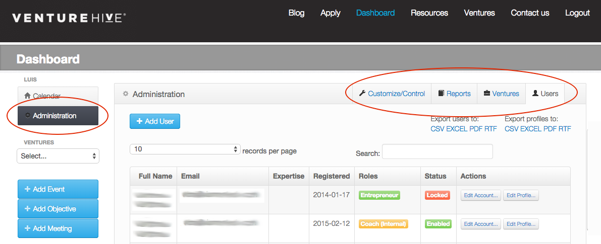
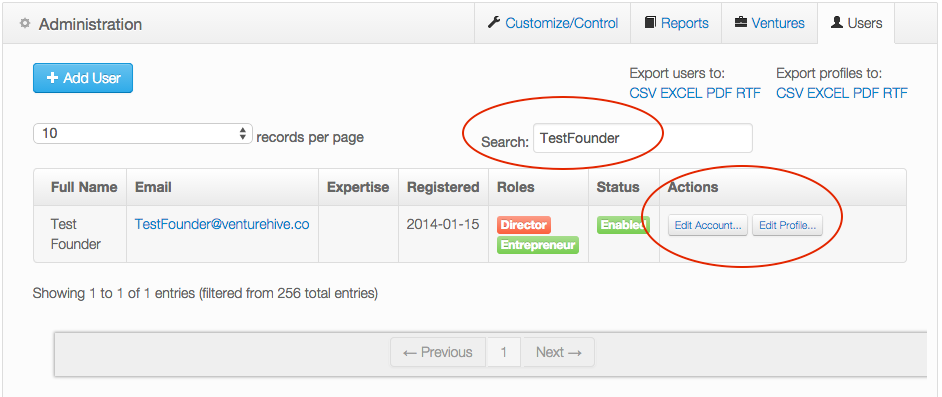

# Administration

If you have been granted an administrator role -- either `Administrator`, `Director`, `User Administrator`, or `Content Developer` -- then you will find the Adminstrator menu in the left nav section after clicking on the `Dashboard` menu. You will only see the  Administration tabs that are appropriate for your assigned roles.

## User Administration

Adding or updating `User` information is performed under the *Administration > Users* tab. There you will find user search capabilities and an easy-to-read paginated table listing all the users on the site. Updating a user is similar to [updating your own user information](user.html#edit-your-account-information) except that when editing others' information, the two familiar action buttons "Edit Account" and "Edit Profile" are now found under the *Actions* column for a given user.

## Registering Users

Use the "Add User" button found on the *Administration > Users* tab to create new Users for your site. Note that User Account information (authentication information) is separated from User Profile information. See [updating your own user information](user.html#edit-your-account-information) for details on both.

Depending on your `Site Settings`, users can also be allowed to self-register on your site. Site settings also determine whether or not the resulting self-registered user requires administrative approval before being enabled. In the normal case, approval is required when users self-register. *You can ask your Administrator for details on how your Site Settings are configured*

An email notification will be sent to all Directors on your site whenever a new User is created. This notification is sent regardless of whether or not the user was added manually (by an administrator) or if the user self registered.

## Venture Administration

Adding or updating `Venture` information is performed under the *Administration > Ventures* tab. There you will find venture search capabilities and an easy-to-read paginated table listing all the Organizations (Ventures) on the site. Two action buttons, "Edit Venture" and "Edit Venture Profile", are found under the *Actions* column for each venture.

Depending on your `Site Settings`, users may be allowed to self-register their own ventures on your site. Site settings also determine whether or not the resulting user-registered venture requires administrative approval before being enabled. In the normal case, approval is required when users register their own companies, but user editing of companies usually does not require approval. *You can ask your Administrator for details on how your Site Settings are configured*

## Adding Ventures

Use the "Add Venture" button found on the *Administration > Ventures* tab to create new Ventures on your site. Note that `Venture` information is separated from `Venture Profile` information. See [manage ventures](user.html#manage-ventures) for details on both.
