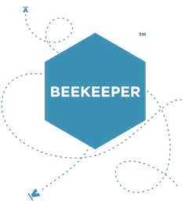

Beekeeper™ is Venture Hive's cloud platform for tracking and managing the various nitty gritty details at your Venture Hive site. What details, you ask? Well we decided to start with... 

1. Event/Meeting/Objective management
2. Entrepreneur management and tracking
3. Venture (Company) management and tracking
4. Venture promotion
5. Calendars/iCal
6. Venture and Product Metrics
7. Resource curation
8. Site promotion
9. Reports
10. Integration with our curricula
11. Notifications

We try to take care of the small things so that you can focus on the success of your businesses and entrepreneurs.
