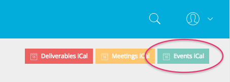
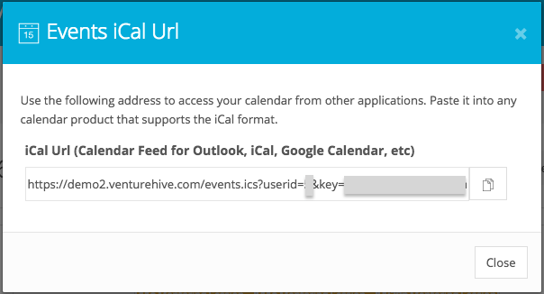

# Getting Started

## Register Your Account

Some Beekeeper sites allow user "self-registration" via the "Register" link from the main menu of the site. If your site allows self-registration (you'll know if you see a "Register" menu item), then simply click on the menu item, enter the requisite information and await a confirmation email. Your new account will be disabled until you confirm your registration. If your site does **not** allow self registration, then an administrator will have to create your account for you.

## Edit Your Account Information

You are encouraged to update your user account and profile information by clicking on "User menu" in the upper right of your screen and then clicking on "Edit Account..." or "Edit Profile...".

| Edit Account Fields            | Edit Profile Fields                                        |
|:------------------------------:|:----------------------------------------------------------:|
| Email, Password   You are permitted to change your account email and your password only unless you have been granted an administrator <a href="#Roles">role</a>.    | First Name, Last Name, Nickname, Phone, Profile Picture, Gender, Website, Twitter URL, LinkedIn URL, Facebook URL, Bio, Interests, How did you hear about us?, Birthday, Featured Event notification preference, Areas of Expertise |

# Manage Content

Beekeeper helps you manage Events, Meetings and Deliverables for your program and only lets people see the content that they are supposed to see as dictated by their role.

## Calendar & iCal

All "scheduleable" content (`Events`, `Meetings`, and `Deliverables`) are displayed in the context of a calendar. A list view is also available. Both are available in a quick view section at the top of the the "Dashboard" screen.

Each "scheduleable" content type has its own/separate iCal feed. You may subscribe to each of these iCal feeds using any calendar tool that supports the iCal format (for example: Google Calendar, Outlook, iCal, etc).

## Events

Events represent internal or public calendar entries created for your site members or audience as a whole rather than as individuals (unlike Meetings). Events designated as "Public" are available to all authenticated and unauthenticated site users while private events (the default) are only visible to authenticated users.

As with all scheduled content, you can subscribe to a personalized `Events` iCal feed by clicking on the Events iCal button  

The Events iCal URL provided to you is unique to your account and shows all of the events that are available to you. The URL provided works for all iCal supported calendars: Google Calendar, Outlook, iCal, etc.  

## Meetings

As with all scheduled content, you can subscribe to a personalized `Meetings` iCal feed by clicking on the Meetings iCal button  

The Meetings iCal URL provided to you is unique to your account and shows all of the Meetings to which you are invited. The URL provided works for all iCal supported calendars: Google Calendar, Outlook, iCal, etc.  

## Meeting Notes

## Deliverables

As with all scheduled content, you can subscribe to a personalized `Deliverables` iCal feed by clicking on the Deliverables iCal button  

The Deliverables iCal URL provided to you is unique to your account and shows all of the Deliverables to which you are invited. The URL provided works for all iCal supported calendars: Google Calendar, Outlook, iCal, etc.  

## Manage Ventures

Core `Venture` administration is typically left to the administrators of your site, but `Venture Profile` management is the user's responsibility. You are encouraged to update your venture profile information by going to the "Dashboard" screen and then clicking on the venture that you will be editing from the "Actions" box. Once you are on the company page, you will click on the the "Edit Venture Profile" button to make any changes.

Some sites may permit their users to register their own ventures on the site. If the site settings are set to allow this, then you will see an "Add Venture" button in the left nav area grouped with the other "Add" buttons. In the more common (but not default) case where site settings allow for core Venture *updates*, an "Edit Venture" button will be shown alongside to the "Edit Venture Profile" button. *You can ask your Administrator for details on how your Site Settings are configured*

 

| Edit Venture Fields            | Edit Venture Profile Fields                                        |
|:------------------------------:|:----------------------------------------------------------:|
| Name, Member Since, Members, Executive, Administrators, Coaches, Disabled   You are not permitted to change your coach list nor your disabled status unless you have been granted an administrator <a href="#Roles">role</a>. | Legal name, Articles of Incorporation URL, Description, Cohorts, Phase, Date Founded, Where Founded?, Industries, Logo, Website URL, Twitter URL, LinkedIn URL, Facebook URL, Promotional Images, Promotional Video URLs ( *embedded URLs only* ) |

## Roles

Each user is granted one or more roles in Beekeeper. Your role dictates which actions your are permitted to perform (creating, editing, or deleting content) and what you are permitted to view.

Your roles are shown in the Profile box in the left nav area in the "Dashboard" pages. 

In the tables below, we have separated roles into two types: Administrator Roles (`ADMINISTRATOR`, `DIRECTOR`, `USER ADMINISTRATOR`, `CONTENT DEVELOPER`) and User Roles (`ENTREPRENEUR`, `COACH`, `COACH (INTERNAL)`, 'EXECUTIVE', 'REPORTS USER').

### Administrator Roles

| &nbsp;                         | ADMINISTRATOR | DIRECTOR | USER ADMINISTRATOR | CONTENT DEVELOPER | EXECUTIVE |
|:------------------------------:|:-------------:|:--------:|:------------------:|:-----------------:|:----------|
| Create Users                   |       X       |     X    |          X         |                   |           |
| Edit (Other) Users             |       X       |     X    |          X         |                   |           |
| Delete Users                   |       X       |          |                    |                   |           |
| Edit (Others') User Profiles   |       X       |     X    |          X         |                   |           |
| Assign (Others') Roles         |       X       |     X    |          X         |                   |           |
| Set (Others') Passwords        |       X       |     X    |                    |                   |           |
| Create Events                  |       X       |     X    |                    |         X         |           |
| Edit Events                    |       X       |     X    |                    |         X         |           |
| Delete Events                  |       X       |     X    |                    |         X         |           |
| View (Others') Meetings        |       X       |     X    |                    |                   |           |
| Create Meetings                |       X       |     X    |                    |                   |           |
| Edit Meetings                  |       X       |     X    |                    |                   |           |
| Delete Meetings                |       X       |     X    |                    |                   |           |
| View (Others') Deliverables    |       X       |     X    |                    |                   |           |
| Create Deliverables            |       X       |     X    |                    |                   |           |
| Edit Deliverables              |       X       |     X    |                    |                   |           |
| Delete Deliverables            |       X       |     X    |                    |                   |           |
| View (Others') Venture Data    |       X       |     X    |                    |                   |           |
| Edit (Others') Ventures        |       X       |     X    |                    |                   |           |
| Delete Ventures                |       X       |          |                    |                   |           |
| Edit (Others') Venture Profiles|       X       |     X    |                    |                   |           |
| View System Reports            |       X       |     X    |                    |                   |           |
| Change Site Colors             |       X       |          |                    |                   |           |
| Change Site Time Zone          |       X       |          |                    |                   |           |
| Edit Front Page Content        |       X       |          |                    |         X         |           |
| Change Site Contact Info       |       X       |          |                    |         X         |           |
| Change Site Social Media Info  |       X       |          |                    |         X         |           |

### User Roles

| &nbsp;                                                |     ENTREPRENEUR     |     COACH (NON-STAFF)   | COACH (INTERNAL/STAFF) | EXECUTIVE | REPORTS USER |
|:-----------------------------------------------------:|:--------------------:|:-----------------------:|:----------------------:|:---------:|:-------------|
| Create/Edit/Delete Events                             |                      |                         |                        |           |              |
| View Events                                           |       X              |       X                 |         X              |           |              |
| Create Meetings                                       |       X              |       X                 |         X              |           |              |
| Edit Meetings (If Created by You)                     |       X              |       X                 |         X              |           |              |
| Delete Meetings                                       |                      |                         |                        |           |              |
| View Meetings (If Invited or Created)                 |       X              |       X                 |         X              |           |              |
| View Meetings (If NOT Invited)                        |       X1  |                         |         X              |           |              |
| Create/Edit Meeting Notes (If Invited to Meeting)     |       X              |       X                 |         X              |           |              |
| Create/Edit Meeting Notes (If NOT Invited to Meeting) |       X1  |                         |         X              |           |              |
| View Meeting Notes (If Invited to Meeting)            |       X              |       X                 |         X              |           |              |
| View Meeting Notes (If NOT Invited to Meeting)        |       X1  |                         |         X              |           |              |
| View Internal Meeting Notes (If Invited to Meeting)   |                      |                         |         X              |           |              |
| Delete Meeting Notes (If Created)                     |       X              |       X                 |         X              |           |              |
| Create Deliverables                                   |       X              |       X                 |         X              |           |              |
| Edit Deliverables If Created/Assigned)                |       X              |       X                 |         X              |           |              |
| Edit Deliverables If NOT Created/Assigned)            |                      |                         |                        |           |              |
| View Deliverables If Created/Assigned)                |       X              |       X                 |         X              |           |              |
| View Deliverables If NOT Created/Assigned)            |       X1  |                         |         X              |           |              |
| Delete Deliverables If Created/Assigned)              |                      |                         |                        |           |              |
| View Program Metrics (On Dashboard)                   |                      |                         |                        |    x      |              |
| View Rollup Reports (On Dashboard)                    |                      |                         |                        |    x      |    x         |
1If specified as an Executive for Company