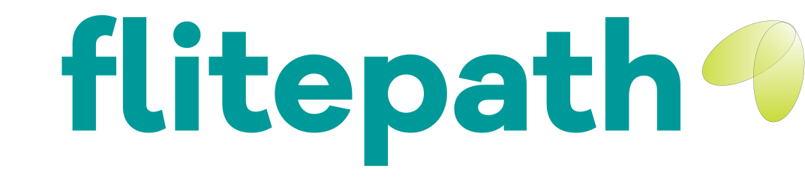

Flitepath is a cloud platform for tracking and managing the various nitty gritty details for your program. What details, you ask? Well we decided to start with... 

1. Event/Meeting/Deliverable management
2. Entrepreneur management and tracking
3. Venture (Company) management and tracking
4. Venture promotion
5. Calendars/iCal
6. Venture- and Product-level Metrics
7. Site promotion
8. Reports & Analytics
9. Integration with curricula (ours or yours or both)
10. Learning Content (Resource) curation
11. Notifications
12. Slack integration (Coming soon!)

We try to take care of the small things so that you can focus on the success of your businesses and entrepreneurs.
